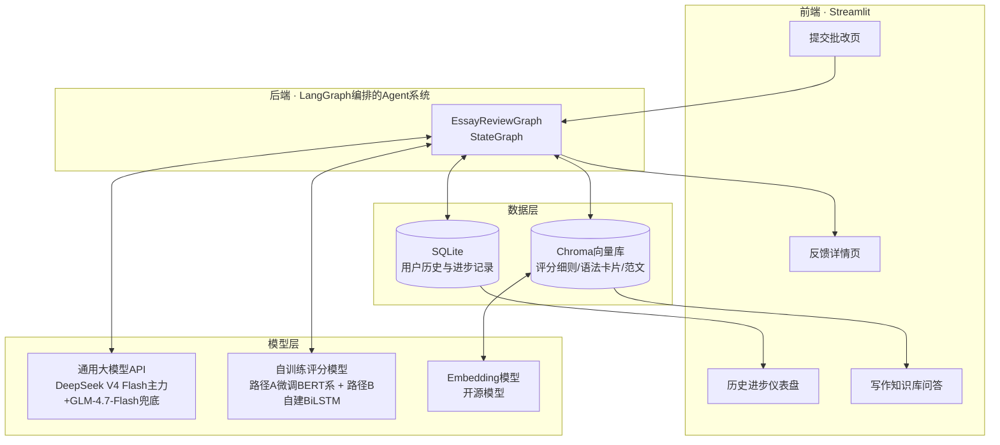
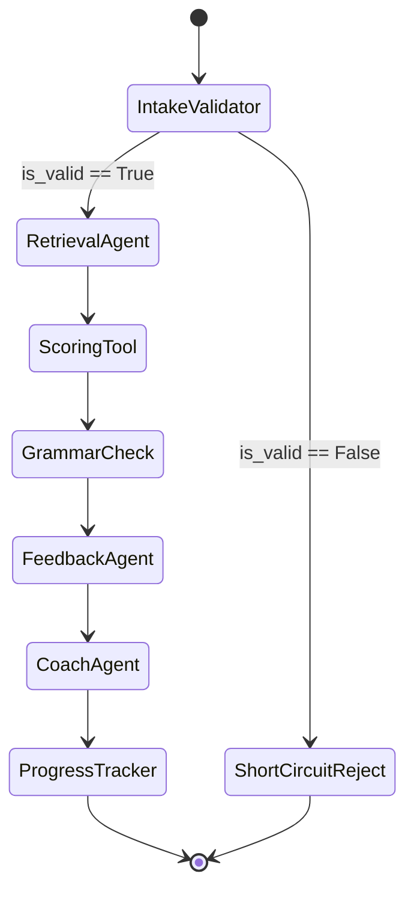

# 01 系统架构与Agent设计

## 整体架构图



## LangGraph状态图设计

### State（图状态定义）

```python
class EssayReviewState(TypedDict):
    user_id: str
    essay_text: str
    essay_prompt_id: int          # 对应ASAP-AES的essay_set，决定检索哪一类rubric
    is_valid: bool                # IntakeValidator的判定结果
    reject_reason: str | None
    retrieved_context: list[str]  # RetrievalAgent检索到的rubric/语法卡片/范文片段
    quant_score: float            # ScoringTool给出的量化评分
    trait_scores: dict[str, float]  # 多头输出的分项评分（内容/结构/语言），已确认为主线方案
    grammar_errors: list[dict]    # 语法检查工具输出
    qualitative_feedback: str     # FeedbackAgent生成的结构化反馈
    revision_plan: str            # CoachAgent生成的修改建议与练习推荐
    history_summary: dict         # 该用户历史提交摘要，供个性化使用
```

### 节点（Agent/Node）职责表

| 节点 | 类型 | 输入 | 输出 | 职责 |
|---|---|---|---|---|
| `IntakeValidatorNode` | 规则+轻量判断（可用小模型或规则） | `essay_text` | `is_valid`, `reject_reason` | 校验作文长度是否合理、是否明显偏题/灌水；不合格则短路返回，避免浪费后续调用 |
| `RetrievalAgentNode` | RAG检索 | `essay_prompt_id`, `essay_text` | `retrieved_context` | 从Chroma向量库中检索该题目对应的评分细则、相关语法规则卡片、高/低分范文片段 |
| `ScoringToolNode` | 工具调用（本地推理） | `essay_text`, `essay_prompt_id` | `quant_score`, `trait_scores` | 调用`EssayScorer`（路径A微调模型占0.95、路径B自定义构建模型占0.05的非等权融合），产出量化评分与分项评分，同时覆盖"预训练模型-微调"与"自定义构建模型"加分项 |
| `GrammarCheckNode` | 工具调用 | `essay_text` | `grammar_errors` | 纯Python正则规则库做语法/拼写检查（评估后放弃`language_tool_python`，见`Docs/TODO.md`），为FeedbackAgent提供具体错误位置，并驱动`trait_scores`三项（content/organization/language）的启发式调整 |
| `FeedbackAgentNode` | LLM推理 | `essay_text`, `retrieved_context`, `quant_score`, `grammar_errors` | `qualitative_feedback` | 用通用大模型生成结构化定性反馈：优点、不足、逐条语法纠正（英文原句+中文讲解） |
| `CoachAgentNode` | LLM推理 | `qualitative_feedback`, `history_summary` | `revision_plan` | 结合该用户历史弱项，生成个性化修改建议和1~2道针对性练习题 |
| `ProgressTrackerNode` | 数据写入 | 本次完整结果 | 写入SQLite | 记录本次提交的评分/分项/错误类型，更新该用户的进步曲线与弱项统计 |

### 路由逻辑（条件边）



主链路是"校验→检索→评分→语法检查→定性反馈→个性化辅导→进步记录"的近似线性流程，只在入口处有一个条件分支（无效输入短路返回）。**这是刻意的设计取舍**：4天工期下，保证主链路稳定可演示比堆叠复杂的循环/反思结构更重要。

### 有余力再做（Stretch Goal，非必须交付项）

如果Day4还有时间，可以加一个`CriticAgentNode`：对`FeedbackAgentNode`的输出做一次自我复核（反思模式，类似Reflexion/Self-Refine的思路），发现反馈过于空泛或与检索到的rubric不一致时打回重新生成一次。这是加分锦上添花项，**不要在主线时间紧张时优先做这个**，参考`04-四天开发计划与分工.md`的优先级排序。

## Agent使用的工具（Tools）清单

| 工具名 | 封装方式 | 说明 |
|---|---|---|
| `essay_scorer_tool` | 包装`EssayScorer`（微调模型0.95 + 自建模型0.05的非等权融合）的推理函数为LangChain Tool | 输入作文文本+题目集ID，输出量化评分与分项评分（0-100归一化后的分数） |
| `grammar_check_tool` | 包装语法检查库/正则规则集 | 输出错误列表（错误片段、错误类型、建议修正） |
| `rubric_retriever_tool` | LangChain Retriever（Chroma） | 按题目集检索对应评分细则文本 |
| `sample_essay_retriever_tool` | LangChain Retriever（Chroma） | 检索该题目集下的高分/低分范文片段用于对比说明 |
| `user_history_tool` | 包装SQLite读操作 | 读取该用户过往提交的评分趋势与高频错误类型 |

## RAG知识库设计

知识库（Chroma向量库）由以下自建内容构成，对应"数据集：开源数据集+自定义数据集"要求中的自定义部分：

1. **评分细则（Rubric）**：参照ASAP-AES官方评分标准和通用英语写作评分维度（内容/结构/语言/语法），团队自行整理为结构化文本，每个essay_set一份。
2. **语法规则卡片**：中国学生常见英语写作错误的规则说明（主谓一致、时态一致、冠词使用、介词搭配等），团队自行编写，中英双语。
3. **范文库**：从ASAP-AES训练集中抽取各分数段的代表性作文片段，附团队标注的"好在哪里/差在哪里"简评，用于让FeedbackAgent的建议有具体范例可引用，而不是空泛套话。

分块（chunking）策略：按语义段落切分，每块附带`essay_set`、`score_band`（高/中/低）、`content_type`（rubric/grammar/sample）三个元数据字段，检索时按元数据过滤+相似度排序两级筛选，避免跨题目集串味。

## 前端页面设计（Streamlit）

| 页面 | 功能 |
|---|---|
| 提交批改 | 输入/粘贴作文文本，选择题目类型，点击提交后展示Graph运行进度（可用Streamlit的status/spinner展示各Agent节点执行到哪一步，增强"多智能体协作"的可视化演示效果，答辩演示会很直观） |
| 反馈详情 | 展示量化评分、分项评分（雷达图）、结构化定性反馈、逐条语法纠正、CoachAgent的修改建议与推荐练习 |
| 历史进步仪表盘 | 该用户历次提交的评分趋势折线图、弱项类型分布雷达图随时间的变化、下一步建议练习的类型统计（**这是申请创意加分的核心展示页**） |
| 写作知识库问答 | 直接对RAG知识库做检索式问答，学生可以问"这类作文的评分标准是什么""这个语法点怎么用"，复用`rubric_retriever_tool`/`grammar_check_tool`所依赖的同一套知识库 |
