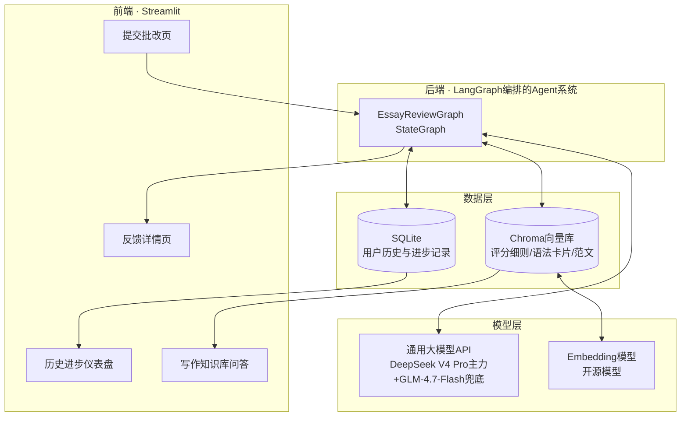
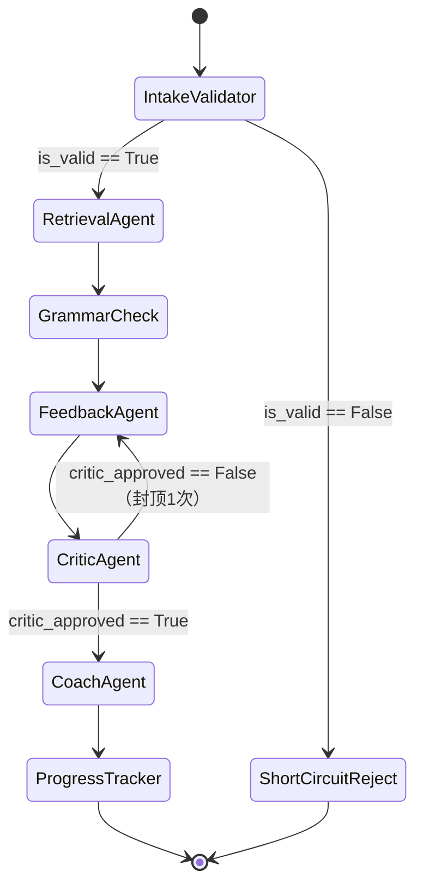

# 01 系统架构与Agent设计

## 整体架构图



量化评分和定性反馈现在都由LLM（结合`src/official_rubrics.py`的公开评分量表）给出，不再有单独的自训练评分模型层——这是本轮技术路线调整后的架构，之前用过的自训练模型（微调DistilBERT+自建BiLSTM）训练代码和权重已删除，见`CLAUDE.md`"已确认、不要再改的设计决策"。

## LangGraph状态图设计

### State（图状态定义）

```python
class EssayReviewState(TypedDict):
    user_id: str
    essay_text: str
    exam_type: str | None         # GENERAL/IELTS/TOEFL
    exam_subtype: str | None      # TOEFL：Write an Email或Academic Discussion
    essay_topic: str | None       # 用户填写的作文题目/prompt原文，会喂进FeedbackAgent的prompt
    is_valid: bool                # IntakeValidator的判定结果
    reject_reason: str | None
    retrieved_context: list[str]  # RetrievalAgent检索到的rubric/语法卡片/范文片段
    grammar_errors: list[dict]    # 语法检查工具输出
    qualitative_feedback: str     # FeedbackAgent生成的反馈，拍平成Markdown文本（兜底展示用）
    feedback_dimensions: dict     # 按维度拆分的结构化反馈（优势点/建议改进的方面/改进小贴士），前端渲染成卡片，见下方"反馈可读性：卡片式结构化输出"
    revision_plan: str            # CoachAgent生成的修改建议与练习推荐，拍平成Markdown文本（兜底展示用）
    coach_plan: dict              # 结构化辅导计划（优先修改清单/针对性练习/AI现场创作的高分范文），前端渲染成卡片
    history_summary: dict         # 该用户历史提交摘要，供个性化使用
    score_source: str             # 固定为llm_rubric
    primary_score: float | None   # 页面主分数
    primary_max: float | None
    primary_label: str | None
    secondary_score: float | None # 目前三种考试类型都不使用，恒为None，字段保留供未来扩展
    secondary_max: float | None
    secondary_label: str | None
    official_rubric_scores: dict[str, float]  # 按官方量表给出的分项数值（IELTS四维度/GENERAL四维度/TOEFL单题）
    score_details: dict           # 分项分数明细
    score_error: str | None       # LLM结构化分数解析失败时保留原因，不伪造0分
```

**`exam_type`决定评分量表**：GENERAL/IELTS/TOEFL三种当前支持的作文类型统一走"LLM＋对应公开评分标准"（`src/official_rubrics.py`），不区分特殊路由。这是模拟评阅、练习参考分，不宣称为考试院/ETS/IELTS正式成绩。

### 节点（Agent/Node）职责表

| 节点 | 类型 | 输入 | 输出 | 职责 |
|---|---|---|---|---|
| `IntakeValidatorNode` | 规则+轻量判断（可用小模型或规则） | `essay_text` | `is_valid`, `reject_reason` | 校验作文长度是否合理、是否明显偏题/灌水；不合格则短路返回，避免浪费后续调用 |
| `RetrievalAgentNode` | RAG检索 | `exam_type`, `essay_text` | `retrieved_context` | 从Chroma向量库中检索该考试类型对应的评分细则、相关语法规则卡片、高/低分范文片段 |
| `GrammarCheckNode` | 工具调用 | `essay_text` | `grammar_errors` | 纯Python正则规则库做语法/拼写检查（评估后放弃`language_tool_python`，见`Docs/TODO.md`），为FeedbackAgent提供具体错误位置 |
| `FeedbackAgentNode` | LLM推理 | 作文、RAG细则、语法结果 | 定性反馈+按公开量表给出的结构化数值分 | 按`src/official_rubrics.py`的量表说明生成`rubric_scores`+结构化定性反馈；打分prompt带few-shot校准示例 |
| `CriticAgentNode` | LLM推理（反思复核） | `FeedbackAgentNode`产出的定性反馈 | `critic_approved`, `critic_notes` | 复核反馈是否空泛套话/自相矛盾/建议不可执行，不合格打回`FeedbackAgentNode`重新生成，封顶1次重试 |
| `CoachAgentNode` | LLM推理（自主调用`dictionary_lookup`工具） | `qualitative_feedback`, `essay_topic`, `history_summary` | `coach_plan`（`revision_plan`兜底文本） | 结合该用户历史弱项，生成结构化的优先修改清单（2~3条）、针对性练习（1~2道）、以及一篇AI现场创作的同题高分范文（含学习要点） |
| `ProgressTrackerNode` | 数据写入 | 本次完整结果 | 写入SQLite | 记录本次提交的评分/错误类型，更新该用户的进步曲线 |

### 路由逻辑（条件边）



主链路基本是线性的，只有一处反思循环：校验 → 检索 → 语法检查 → 反馈（含量表打分）→ **反思复核（不合格打回反馈重写，封顶1次）** → 辅导 → 历史记录。入口无效文本仍会短路返回。三种考试类型走同一条路径，不再有按类型分流的条件路由（本轮之前GENERAL/CET/考研会分流进单独的`ScoringToolNode`，该节点连同自训练模型已删除，见`CLAUDE.md`）。

### 反思循环（已实现，不再是Stretch Goal）

`CriticAgentNode`已经实现：对`FeedbackAgentNode`的输出做一次自我复核（判断是否空泛套话/自相矛盾/建议不可执行），不合格打回`FeedbackAgentNode`重新生成一次，封顶1次重试。实现细节和验证方式见`Docs/02-Progress.md`第四十七轮记录、设计决策见`CLAUDE.md`。

## Agent使用的工具（Tools）清单

以下几个是LangGraph按固定路由**确定性调用**的工具（图路由决定要不要调，模型无权决定）：

| 工具名 | 封装方式 | 说明 |
|---|---|---|
| `grammar_check_tool` | 包装语法检查库/正则规则集 | 输出错误列表（错误片段、错误类型、建议修正） |
| `rubric_retriever_tool` | LangChain Retriever（Chroma） | 按题目集检索对应评分细则文本 |
| `sample_essay_retriever_tool` | LangChain Retriever（Chroma） | 检索该题目集下的高分/低分范文片段用于对比说明 |
| `user_history_tool` | 包装SQLite读操作 | 读取该用户过往提交的评分趋势与高频错误类型 |

`dictionary_lookup`（`src/agents/tools.py`）不一样：这是唯一一个通过LangChain
`.bind_tools()`交给**模型自主决定**要不要调、调几次的工具，只挂在
`coach_agent_node`上——生成练习题时如果要用到某个具体单词的释义/同义词/例句，
模型可以自己判断是否需要查证后再写进去，而不是凭空编造。查免费、免Key的Free
Dictionary API（`api.dictionaryapi.dev`），标准库`urllib`实现，不引入新pip依赖；
查询失败/超时会把错误信息作为工具结果返回给模型，模型据此改用已有知识作答，
不会中断整个批改流程。绑定/调用链路本身出问题（比如供应商不支持function
calling）会被`coach_agent_node`捕获，整体降级为不查词的普通生成。

## RAG知识库设计

知识库（Chroma向量库，`data/kb/`下的md文件，`src/rag/build_kb.py`递归收录+切分+embedding）由以下自建内容构成，对应"数据集：开源数据集+自定义数据集"要求中的自定义部分：

1. **语法规则卡片**：中国学生常见英语写作错误的规则说明（主谓一致、时态一致、冠词使用、介词搭配等），团队自行编写，中英双语（`data/kb/grammar_cards.md`）。
2. **评测类型专属评分细则**：`data/kb/exam_rubrics/{general,ielts,toefl}.md`，覆盖通用英语作文、托福和雅思Task 2。

**诚实缺口**：上述`data/kb/`下的Markdown源文件当前在仓库里并不存在（既没有提交进git，本地也没有），`retrieval_agent_node`检索不到专属文件时会优雅降级成全库检索，不会报错崩溃，但检索到的不是真正的专属评分细则，见`Docs/TODO.md`。

**metadata过滤字段**：每个chunk只带一个`source`字段（相对`data/kb/`的文件路径，比如`exam_rubrics/general.md`），`retrieval_agent_node`在`state`带`exam_type`时会按`source`过滤成只在对应考试类型的专属文件里检索，检索不到再退回全库检索。

## 反馈可读性：卡片式结构化输出

`FeedbackAgentNode`用`LLM_RUBRIC_PROMPT`要求LLM返回按维度拆分的`dimension_feedback`结构化JSON（每个维度含`strengths`/`improvements`/`tips`三块，`tips`是2~3条`{title, comment, example}`，内容要求丰富具体，不限制篇幅），而不是一整段Markdown长文本。**维度统一为4个通用维度**（`content`内容主旨/`coherence`结构与衔接/`language`语言运用/`grammar`语法多样性与准确性），三种考试类型共用同一份`src/official_rubrics.py`里的`DIMENSION_LABELS`映射，不跟着每种考试自己的官方评分维度走——官方维度（IELTS的`task_response`等、TOEFL的`task_score`、GENERAL的`content_score`等）仍然用于`rubric_scores`数值评分的计算，和`dimension_feedback`是两套独立的key，这样学生跨考试类型看到的反馈卡片数量、顺序、名称都一致。`build_dimension_feedback()`/`dimension_entry()`把原始JSON防御性规整成统一形状（某个维度缺字段不报错，只是内容留空），`src/ui_theme.py`的`render_feedback_dimensions()`把这个结构渲染成卡片（优势点/建议改进的方面/关于如何改进的小贴士），前端渲染时对所有LLM生成的文本字段都做了`html.escape()`，防止内容里出现的特殊字符破坏卡片HTML结构。`qualitative_feedback`字段仍然保留（由`flatten_dimension_feedback()`拍平成Markdown文本），供`CoachAgentNode`的上下文和没有卡片渲染能力的旧历史记录（本轮之前提交的、数据库里`feedback_dimensions`列为空的记录）兜底展示，不会两条腿都断。

`CoachAgentNode`同样改成结构化JSON输出（`coach_plan`）：`action_items`（2~3条优先修改清单）、`exercises`（1~2道针对性练习）、`model_essay`（AI针对同一题目现场创作的高分范文，含标题/正文/2~3条"值得学习的地方"），`build_coach_plan()`/`flatten_coach_plan()`（`src/agents/nodes.py`）做同样的防御性规整+兜底拍平，`src/ui_theme.py`的`render_coach_plan()`渲染成卡片——**视觉上和`render_feedback_dimensions()`的评价类卡片刻意不同**（暖色调行动卡+独立的范文阅读卡，蓝色系是"评价"、暖色系是"行动"），`model_essay`卡片明确标注"AI现场创作·仅供参考，非真实考生作文"，不得误导成真实高分卷（早期设计文档曾设想的`sample_essay_retriever_tool`范文检索，因缺少配套的范文库标注数据没有实现，这是替代方案，如实说明两者的区别）。

页面宽度：`src/ui_theme.py`的`.block-container`样式把三个页面统一约束在`1360px`居中定宽容器内（`layout="wide"`+自定义CSS覆盖），避免宽屏显示器上内容铺满整个浏览器宽度、行长得不美观。

已在`deploy-server`上用真实DeepSeek调用验证过IELTS（4维度反馈+完整`coach_plan`，含约3000字的高分范文）能正确生成完整的卡片数据；GENERAL/TOEFL走同一条`LLM_RUBRIC_PROMPT`路径，逻辑上是同一套代码，但本轮改动后还没有重新跑过针对GENERAL新四维度量表的真实端到端验证，见`Docs/TODO.md`。

## 前端页面设计（Streamlit）

两个独立本地文件（Streamlit多页应用），左侧导航栏切换：

| 文件 | 页面 | 功能 |
|---|---|---|
| `app.py` | 产品介绍页 | Hero区+功能卡片介绍项目；登录/注册表单（`src/storage/db.py`的`users`表+PBKDF2密码哈希）；用户名密码校验通过后直接登录成功（曾经做过滑块验证，按用户要求已取消） |
| `pages/2_工作台.py` | 写作批改 | 原"提交批改"+"反馈详情"两个tab合并成一个：没有结果时显示提交表单（选GENERAL/IELTS/TOEFL，通用评测自由填写题目，TOEFL另选题型）；有结果时显示题目卡+左右分栏（左侧作文原文带语法错误内联高亮下划线、右侧分数卡），布局参考essay.art重新设计（不是抓取/复制对方代码），下方接`render_feedback_dimensions()`/`render_coach_plan()`/`render_grammar_error_cards()`三组卡片 |
| `pages/2_工作台.py` | 历史进步仪表盘 | 按`primary_score / primary_max × 100`统一不同量表的趋势，同时显示作文类型与评分来源 |
| `pages/2_工作台.py` | 写作知识库问答 | 可限定考试类型，复用Chroma检索和LLM生成，不走完整评分Graph |

`pages/2_工作台.py`整页都要求`st.session_state.logged_in`为真才能访问，未登录会被拦截并提示去登录页；`user_id`直接使用登录用户名，历史追踪和登录账号绑定。
