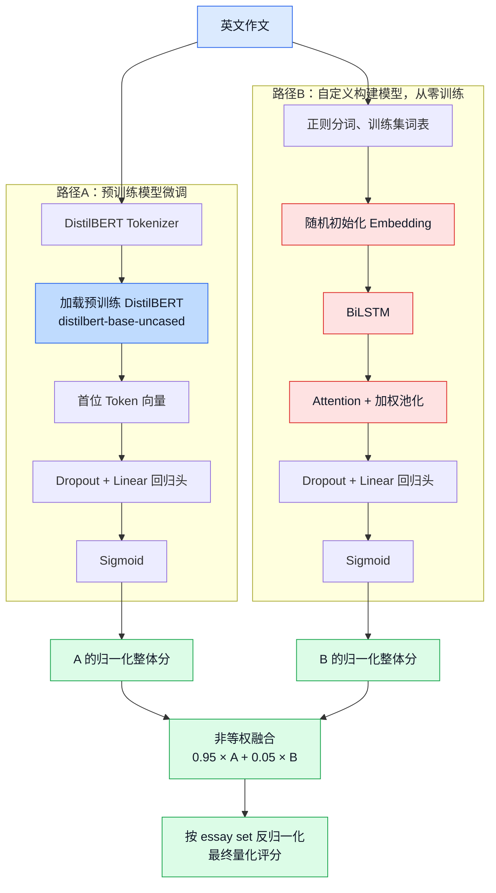

# 09 模型训练与Agent编排操作手册

> 负责人：田溯开。负责范围：两条评分模型训练（`src/training/`）+ LangGraph状态图与Agent节点（`src/agents/`）+ RAG知识库构建（`src/rag/`）。这两块在代码里紧密耦合（`src/agents/nodes.py`直接调用`src/training/essay_scorer.py`），合并成一份文档。

## 一、负责范围里有哪些文件

| 文件 | 作用 |
|---|---|
| `src/training/train_finetuned.py` | 路径A：微调`distilbert-base-uncased`，回归整体分 |
| `src/training/train_custom.py` | 路径B：自建BiLSTM+Attention，从零训练（不加载任何预训练权重） |
| `src/training/common.py` | QWK计算（`macro_qwk`，按essay_set分别算再宏平均）、分数反归一化 |
| `src/training/essay_scorer.py` | `EssayScorer`：统一推理接口，融合A/B两条路径 |
| `src/rag/build_rubric_docs.py` | 从原始数据集提取真实rubric/prompt，生成`data/kb/rubric_essay_set_*.md` |
| `src/rag/build_kb.py` | 把`data/kb/`下的md切分+embedding，写入Chroma向量库 |
| `src/agents/state.py` | `EssayReviewState`：LangGraph状态定义 |
| `src/agents/graph.py` | StateGraph搭建，节点连接与路由逻辑 |
| `src/agents/nodes.py` | 7个节点的具体实现 |
| `src/agents/llm.py` | DeepSeek/GLM双供应商LLM封装，带fallback |

## 二、操作手册

### 1. 训练两条评分模型（需要GPU，本地开发机没有，在训练服务器上跑）

```bash
export CUDA_VISIBLE_DEVICES=<挑一块空闲显存的卡，nvidia-smi先看一眼>
export HF_ENDPOINT=https://hf-mirror.com
export HF_HUB_DISABLE_XET=1
export HF_HOME=<训练服务器上指到/data下的缓存目录>

# 路径A：微调
python -m src.training.train_finetuned \
    --model_name distilbert-base-uncased --epochs 4 --batch_size 32 \
    --output_dir models/essay-scorer-finetuned/v1
# 真实结果：测试集QWK(宏平均)=0.693

# 路径B：自建，从零训练
python -m src.training.train_custom \
    --epochs 12 --batch_size 32 \
    --output_dir models/essay-scorer-custom/v1
# 真实结果：验证集QWK连续3轮不提升，第6轮早停，测试集QWK(宏平均)=0.622
```

两个脚本训练完自动在测试集评估、把QWK写进`training_log.json`（含每个epoch的train_loss/val_loss/val_qwk曲线，答辩展示用这个比只说一个数字有说服力）。

### 本轮实际训练与融合参数

| 项 | 路径A：微调 DistilBERT | 路径B：自建 BiLSTM + Attention |
|---|---|---|
| 数据划分 | 清洗后12,879篇；按`essay_set`分层，训练/验证/测试=10,303/1,288/1,288 | 同左 |
| 训练轮数 | 4 | 最大12，实际第6轮早停 |
| Batch size / 学习率 | 32 / `2e-5` | 32 / `1e-3` |
| 最大长度 | 256 token | 300 token |
| 优化器 / 损失 | AdamW / MSE | Adam / MSE |
| 早停 / 梯度裁剪 | patience=2 / 最大范数1.0 | patience=3 / 最大范数5.0 |
| 特有结构参数 | Dropout=0.1 | vocab=20,000，Embedding=128，BiLSTM hidden=128，Dropout=0.3 |

融合权重在1,288篇验证集上以0.05为步长搜索：最终采用`0.95 × 路径A + 0.05 × 路径B`。该权重固定后在同一批80条测试样本上的macro QWK为0.759；完整搜索记录在`models/weighted_ensemble_eval.json`。

### 两条评分模型架构（答辩展示）

两条路径都输入英文作文、输出按`essay_set`归一化到`[0,1]`的整体分；推理时再按对应题目的分值范围反归一化。当前训练目标只有整体分，`content / organization / language`三个分项是后续语法节点基于可观察信号做的启发式近似，**不是**这两个网络训练出的多头输出。

#### 路径A、B与融合的整体结构



**A 的“微调”不属于图中的前向网络模块：**先加载`distilbert-base-uncased`的预训练参数，然后以ASAP-AES人工分数为监督信号训练；训练时使用MSE作为损失函数、AdamW作为优化器，**DistilBERT编码器参数与新增回归头参数都会更新**。这不同于“冻结预训练模型、只训练分类头”。

路径B不加载任何Transformer或其他预训练checkpoint：词表仅由训练集统计，Embedding、BiLSTM、Attention和回归头全部从随机参数开始端到端训练。因此它既是与路径A的对照实验，也是“自定义构建模型”加分项的实现。A、B权重都存在时，采用验证集选出的非等权融合：`0.95 × score_norm_A + 0.05 × score_norm_B`；只有一个权重存在时则直接使用该单模型预测。

### 2. 构建RAG知识库

```bash
python -m src.rag.build_rubric_docs   # 生成8个essay_set的真实rubric文档
python -m src.rag.build_kb            # 切分+embedding，写入Chroma
# 真实结果：120个chunk，embedding模型BAAI/bge-small-en-v1.5
```

### 3. 用已训练好的模型/知识库跑推理（**关键坑：离线缓存要显式声明**）

训练服务器上第一次训练模型时下载过`distilbert-base-uncased`的基座权重，缓存在`.hf_cache`下；但`EssayScorer`推理时`ScorerModel.__init__`里的`AutoModel.from_pretrained(model_name)`默认还是会先联网核对，如果只设了`HF_HOME`没设`HF_HUB_OFFLINE=1`，网络不稳定时会直接报错（`RuntimeError: Cannot send a request, as the client has been closed.`是本轮实际踩到的报错信息）。**推理场景下要额外加**：

```bash
export HF_HOME=/data/wangchen/tiansukai/RAG/.hf_cache
export HF_HUB_OFFLINE=1     # 强制只用本地缓存，不联网核对
export HF_HUB_DISABLE_XET=1
```

### 4. 跑完整LangGraph端到端测试

```bash
PYTHONPATH=. python scripts/e2e_graph_test.py
```

包含3类用例：正常作文（走完整链路，真实DeepSeek调用）、过短作文（应短路拒绝）、5个边界案例（MIN/MAX_WORDS边界、超长拒绝、语法错误密集、essay_set 8宽分值范围）。**本地开发机跑不了这个**（缺transformers/langgraph依赖），必须在装好完整依赖的机器（训练服务器或部署服务器）上跑。

## 三、LangGraph路由逻辑（答辩最可能被深挖的点之一）

```
intake_validator ──(校验通过)──> retrieval_agent ──> scoring_tool ──> grammar_check
      │                                                                      │
      └──(校验不通过，短路)──> short_circuit_reject ──> END                  ▼
                                                                    feedback_agent
                                                                          │
                                                                          ▼
                                                                    coach_agent
                                                                          │
                                                                          ▼
                                                                  progress_tracker ──> END
```


## 四、核心设计决策 + 真实数据支撑（答辩素材）

### 1. 为什么评分不能直接调用大模型API打分，必须自己训练模型

这是被明确追问时最重要的一条。本轮做了**同一批80条essay_id的公平对比**（不是拿不同样本量比，见`scripts/eval_zero_shot_llm.py`和`scripts/eval_same_sample_and_diagnose_set8.py`）：

| 方法 | 同样80条essay上的macro QWK |
|---|---|
| DeepSeek零样本直接打分（不训练，只靠prompt） | **0.384** |
| 路径A：微调DistilBERT | **0.755** |
| 路径B：自建BiLSTM+Attention | **0.728** |
| A+B非等权融合（A:0.95，B:0.05） | **0.759** |

结果文件：`models/zero_shot_llm_eval.json`、`models/same_sample_trained_eval_finetuned.json`、`models/same_sample_trained_eval_custom.json`、`models/weighted_ensemble_eval.json`。上述结果均使用完全相同的80条`essay_id`（每个essay_set各10条）；非等权融合的权重先由验证集确定，再在该测试样本上固定评估。因此A、B和融合都显著优于DeepSeek零样本；路径A整体优于从零训练的路径B。

非等权融合的权重**不是**在这80条测试样本上挑选的：先在1288条验证集上以0.05为步长搜索，最优为A:0.95、B:0.05（验证集macro QWK=0.708）；固定该权重后才在80条测试样本上评估，QWK为0.759。答辩时应如实表述为“验证集选择的非等权融合方案”。以上结果直接证明"大模型API不经训练直接打分"明显不如自训练模型稳定可靠——大模型不知道具体评分基准的分数分布/校准，零样本预测系统性偏低（尤其essay_set 1和7偏差最明显）。

### 2. essay_set 8为什么两条模型QWK都明显更低（真实诊断，不是猜测）

`models/set8_diagnosis.json`里的数据：
- 训练样本量：essay_set 8只有**578条**，其他集合1252~1440条，明显更少。
- 在essay_set 8全量测试集（72条）上跑真实模型推理，残差(预测-真实)与真实分数的相关系数=**-0.73**，强负相关——说明真实高分被系统性低估、真实低分被系统性高估，是"训练样本少+分值范围宽(15-60)"场景下回归模型典型的"向均值收缩"现象，不是随机误差。
- 结论：不是模型架构问题，是这个essay_set本身训练数据不够、分值range太宽，如果要根治需要针对性扩充这个essay_set的训练样本或做过采样，这属于诚实列出的改进方向，不是本轮4天工期能做的。

### 3. 两条模型路径的对比（微调 vs 自建）

| | 路径A：微调DistilBERT | 路径B：自建BiLSTM |
|---|---|---|
| 是否用预训练权重 | 是 | 否，从零训练 |
| 测试集QWK（宏平均） | 0.693 | 0.622 |
| 覆盖的加分项 | "预训练模型-微调" | "自定义构建模型" |

结论：迁移学习确实有价值（A优于B），但从零训练的路径B依然达到合理水平，证明团队有能力独立搭建完整模型，不是只会调用预训练权重。

### 4. 分项trait_scores的诚实状态

不是训练出来的多头模型，是`grammar_check_node`用启发式信号（语法错误密度/词汇丰富度/段落结构）在整体分基础上做的调整，见`src/training/essay_scorer.py`和`src/agents/nodes.py`顶部的详细说明。**如果被问到这是不是"真正的多维度AI评分"，必须如实说明**，不能包装成已完成的多头训练。

## 五、可能被追问的问题

- **"为什么用DistilBERT不用更大的模型（BERT-base/RoBERTa）？"** —— DistilBERT体积小、训练/推理都快，4天工期下能更快迭代验证；如果时间/算力允许，更大模型理论上QWK会更高，属于可以补充的优化方向。
- **"两条路径怎么融合成最终分数的？"** —— 先在验证集上搜索融合权重，最终固定为`0.95 × score_norm_A + 0.05 × score_norm_B`；如果两个模型权重都存在就走`ensemble`，只有一个就单独用那个。
- **"为什么LangGraph只有一个条件路由，不会太简单吗？"** —— 见第三节回答，主链路够用可控是优先级第一位，见`CLAUDE.md`"优先级原则"。
- **"RAG检索到的内容真的被用上了吗，不是摆设？"** —— 是的，`retrieval_agent_node`检索到的`retrieved_context`直接拼进`FEEDBACK_PROMPT`喂给DeepSeek（见`src/agents/nodes.py`），不是摆设；`scripts/e2e_graph_test.py`验证过完整链路。
