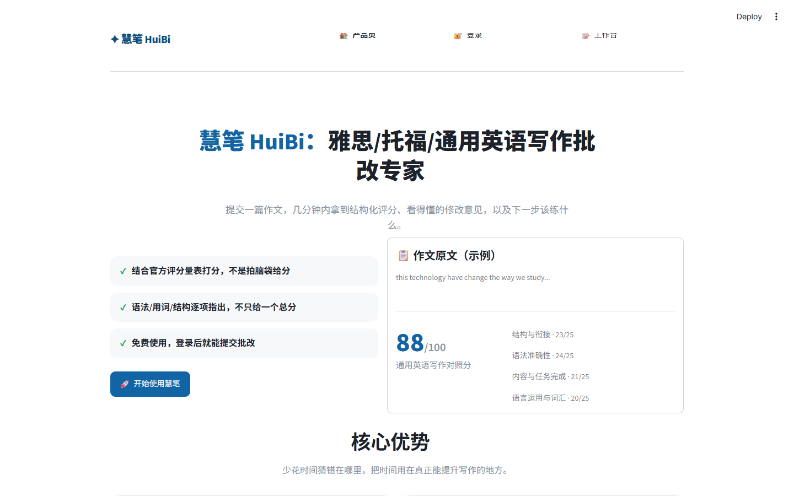

# 慧笔 HuiBi

[](https://github.com/EthanTian05/Huibi/actions/workflows/tests.yml)
[](LICENSE)

基于 LangChain + LangGraph 的英语写作智能批改与个性化学习伴学智能体，面向中国英语学习者（通用英语写作/雅思/托福场景）。提交一篇英语作文，系统结合官方公开评分量表给出结构化对照分、多维度定性反馈（中英双语）、下一步练习建议，并追踪历次提交的进步趋势。纯本地运行，不依赖服务器部署。



## 核心能力

- **量化评分**——LLM（DeepSeek V4 Pro）结合对应考试的公开评分量表给出结构化对照分：雅思 Band Descriptors、托福 ETS 单题评分指南、通用英语写作四维度标准。打分 prompt 带 few-shot 校准示例，控制评分尺度。
- **结构化定性反馈**——语法纠错（本地规则库 + LanguageTool）、结构建议、用词建议（可自主调用词典 API 核实具体用法），中英双语呈现。
- **CriticAgentNode 反思循环**——定性反馈生成后会经过一次质量复核（是否空泛套话、是否自相矛盾、建议是否可执行），不合格自动打回重写，封顶 1 次重试。
- **雅思 Task 1 图表/图片描述题**——上传图片后先用 GLM-4V-Flash 做客观描述，再核对作文数据是否与图表一致、按 Task Achievement 量表打分。
- **个性化学习闭环**——结合历史提交记录，给出学习趋势图和针对性练习推荐。

## 架构

LangGraph 编排的 9 节点状态图：`intake_validator → image_analysis → retrieval_agent → grammar_check → feedback_agent → critic_agent → coach_agent → progress_tracker`（校验不通过短路到 `short_circuit_reject`）。完整节点职责表、路由逻辑、RAG 知识库设计见 [`Docs/01-系统架构与Agent设计.md`](Docs/01-系统架构与Agent设计.md)。

| 层 | 技术选型 |
|---|---|
| Agent 编排 | LangChain + LangGraph |
| 主力 LLM | DeepSeek V4 Pro（免费兜底 GLM-4.7-Flash） |
| 视觉理解 | GLM-4V-Flash（雅思 Task 1 图表识图） |
| RAG 检索 | Chroma + `BAAI/bge-small-en-v1.5`（本地 embedding） |
| 前端 | Streamlit（三页：产品介绍 / 登录注册 / 工作台） |
| 持久化 | PostgreSQL（`psycopg` v3 + 原生 JSONB） |

## 快速开始

```bash
pip install -r requirements.txt
cp .env.example .env   # 填入真实的API Key，见下方"环境变量"
python -m src.rag.build_kb   # 构建RAG知识库（把data/kb/下的Markdown素材embedding进本地Chroma库）
streamlit run app.py
```

Windows 本机双击 [`启动慧笔.bat`](启动慧笔.bat) 可以跳过手动敲命令（自动检查 PostgreSQL/RAG 知识库是否就绪）。完整环境搭建/运行/测试步骤见 [`Docs/03-RUNNING.md`](Docs/03-RUNNING.md)。

## 环境变量

复制 `.env.example` 为 `.env`，填入：

- `DEEPSEEK_API_KEY` / `GLM_API_KEY`：定性反馈/辅导建议/知识库问答用，见 [`Docs/03-RUNNING.md`](Docs/03-RUNNING.md)「环境变量」
- `POSTGRES_HOST`/`PORT`/`DB`/`USER`/`PASSWORD`：本地数据库连接

`.env` 已在 `.gitignore` 里排除，不要提交，也不要把里面的真实值粘贴进任何文档。

## 测试

```bash
pytest                                        # 零依赖单元测试（评分逻辑/校验/路由函数），CI跑这个
python scripts/smoke_test_nodes.py            # 等价的免pip冒烟脚本
PYTHONPATH=. python scripts/e2e_graph_test.py # 完整链路，含真实DeepSeek调用+本地PostgreSQL，手动跑
```

`pytest` 套件（`tests/`）覆盖打分归一化、作文长度校验、语法规则库、CriticAgentNode 短路分支、LangGraph 路由函数，不需要 API Key 或数据库，GitHub Actions 每次 push 自动跑（见上方徽章）。完整端到端链路（真实 LLM 调用、图片理解、数据库读写）需要本地 PostgreSQL + API Key，属于手动验证范围，不在 CI 里跑。

## 评分方式

GENERAL（通用英语作文评测）、IELTS（雅思）、TOEFL（托福）三种当前支持的作文类型，量化评分统一由 LLM 结合对应的公开评分量表给出结构化对照分（雅思 Band Descriptors、TOEFL ETS 单题评分指南、GENERAL 的通用写作四维度评分标准），见 `src/official_rubrics.py`。打分和定性反馈/辅导建议统一用 DeepSeek V4 Pro（免费兜底 GLM-4.7-Flash）。**这是模拟评阅，不代表任何官方考试机构的正式成绩。**

`src/agents/nodes.py` 里的 `retrieval_agent_node`（RAG 检索）在检测到 `data/processed/chroma_kb/` 不存在时，会自动降级为占位结果，**不会报错崩溃**，但会打印明确的 `warnings.warn(...)` 提示告诉你该跑什么命令来补全。

## 项目文档

- [`CLAUDE.md`](CLAUDE.md)：项目背景、已确认的设计决策、环境信息、踩过的坑
- [`Docs/01-系统架构与Agent设计.md`](Docs/01-系统架构与Agent设计.md)：LangGraph 状态图、节点职责表、RAG 知识库设计
- [`Docs/02-Progress.md`](Docs/02-Progress.md)：逐轮工作记录（根因/改法/验证方式）
- [`Docs/03-RUNNING.md`](Docs/03-RUNNING.md)：环境搭建/运行/测试完整步骤
- [`Docs/TODO.md`](Docs/TODO.md)：待办事项与待决策项
